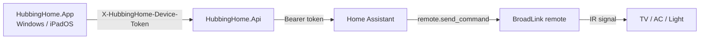

# HubbingHome

HubbingHome は、自宅 LAN 内で使う家族向けリモコンアプリです。

Windows / iPadOS などのネイティブアプリから HubbingHome API に接続し、API が Home Assistant 経由で BroadLink などのスマートリモコンへ `remote.send_command` を送ります。

画面は部屋ごとの横並びリモコンです。テレビは十字キーと音量、エアコンは温度ダイヤルと 0.5 度刻みの温度操作、照明は全灯・常夜灯・明るさ操作を前面に出します。

## 構成



- `src/HubbingHome.Api`: ASP.NET Core API。Home Assistant 連携とリモコン許可リストを持つ。
- `src/HubbingHome.App`: .NET MAUI Blazor Hybrid アプリ。家族が押すリモコン UI。
- `src/HubbingHome.Shared`: API とアプリで共有する DTO。
- `tests/HubbingHome.Api.Tests`: API 側の単体テスト。

## 必要なもの

- .NET SDK 10
- Windows アプリをビルドする場合は .NET MAUI Windows workload
- Node.js / npm
- Home Assistant
- BroadLink など、Home Assistant の `remote` entity として使えるスマートリモコン

## Home Assistant の準備

### 1. Home Assistant を動かす

Windows マシン上で運用する場合は、VirtualBox に Home Assistant OS を入れる構成が扱いやすいです。

VirtualBox ではネットワークを NAT ではなく **ブリッジアダプター** にしてください。Home Assistant と BroadLink が同じ LAN に見える必要があります。

起動後、ブラウザで開きます。

```text
http://homeassistant.local:8123
```

開けない場合は、ルーターの DHCP 一覧で Home Assistant VM の IP を確認し、IP で開きます。

```text
http://192.168.0.xxx:8123
```

本番運用では Home Assistant の IP をルーター側で DHCP 予約して固定してください。

### 2. BroadLink 統合を追加する

Home Assistant 画面で:

```text
設定
-> デバイスとサービス
-> 統合を追加
-> BroadLink
```

追加後、`remote.xxx` の entity ID を確認します。

```text
設定
-> デバイスとサービス
-> エンティティ
-> remote で検索
```

例:

```text
remote.living_broadlink
```

この値を HubbingHome の `RemoteControl:Rooms:*:RemoteEntityId` に設定します。

### 3. 赤外線コマンドを学習する

Home Assistant の「開発者ツール -> アクション」で `remote.learn_command` を実行します。

例: 照明の電源ボタンを `led_light` デバイスの `power` コマンドとして学習する。

```yaml
action: remote.learn_command
target:
  entity_id: remote.living_broadlink
data:
  device: led_light
  command: power
```

例: テレビの音量アップ。

```yaml
action: remote.learn_command
target:
  entity_id: remote.living_broadlink
data:
  device: television
  command: volume_up
```

学習できたら、必ず Home Assistant 単体で送信テストします。

```yaml
action: remote.send_command
target:
  entity_id: remote.living_broadlink
data:
  device: television
  command: volume_up
```

ここで動かないものは、HubbingHome からも動きません。

### 4. BroadLink 学習済みコードを確認する

Home Assistant の BroadLink 統合で学習したコードは、Home Assistant OS 内の `.storage` に保存されます。

```text
/config/.storage/broadlink_remote_XXXXXXXXXXXX_codes
```

Home Assistant の Terminal & SSH アドオンで確認します。

```sh
ls -la /config/.storage | grep broadlink
```

中身を確認:

```sh
cat /config/.storage/broadlink_remote_XXXXXXXXXXXX_codes
```

Windows にダウンロードしたい場合は、一時的に `/config/www` にコピーしてブラウザで開けます。

```sh
mkdir -p /config/www
cp /config/.storage/broadlink_remote_XXXXXXXXXXXX_codes /config/www/broadlink_codes.json
```

ブラウザ:

```text
http://homeassistant.local:8123/local/broadlink_codes.json
```

404 になる場合は、`/config/www` を初めて作った直後の可能性があります。Home Assistant を再起動してから再度開いてください。

作業後は公開用コピーを消します。

```sh
rm /config/www/broadlink_codes.json
```

`.storage` は Home Assistant の内部管理領域です。HubbingHome で使う場合も、読む・コピーするだけにしてください。直接編集は避けてください。

## Home Assistant トークン

HubbingHome API は Home Assistant REST API を Bearer token で呼びます。

Home Assistant で:

```text
左下のユーザー名
-> セキュリティ
-> 長期アクセストークン
-> トークンを作成
```

名前例:

```text
HubbingHome API
```

生成されたトークンは一度しか表示されません。

## API 設定

設定サンプルは `appsettings.Sample.json` です。

本番では秘密値をリポジトリに入れないでください。推奨は環境変数です。

```powershell
$env:ASPNETCORE_ENVIRONMENT="Production"
$env:ASPNETCORE_URLS="http://0.0.0.0:5000"
$env:HomeAssistant__BaseUrl="http://homeassistant.local:8123/"
$env:HomeAssistant__AccessToken="Home Assistant の長期アクセストークン"
$env:HomeAssistant__RequestTimeoutSeconds="10"
$env:HomeAssistant__AllowInsecureHttp="true"
$env:Security__DeviceTokens__0="アプリに入力する長い端末トークン"
```

`AllowInsecureHttp=true` は、自宅 LAN 内で Home Assistant が HTTP の場合に必要です。

### localhost と 0.0.0.0

API をこう起動すると:

```text
Now listening on: http://localhost:5000
```

同じ PC からしか接続できません。

Windows アプリや家族端末から LAN IP で接続するなら、次のように起動します。

```powershell
$env:ASPNETCORE_URLS="http://0.0.0.0:5000"
.\HubbingHome.Api.exe
```

Windows Defender ファイアウォールで TCP 5000 の受信許可が必要になる場合があります。

## RemoteControl 設定

画面に出る部屋・機器・ボタンは Home Assistant から自動取得していません。HubbingHome API の `RemoteControl` 設定が正です。

```json
{
  "RemoteControl": {
    "Rooms": [
      {
        "Id": "living",
        "Name": "リビング",
        "RemoteEntityId": "remote.living_broadlink",
        "Devices": []
      }
    ]
  }
}
```

### 固定コマンド

BroadLink の学習済み JSON が次のような構造の場合:

```json
{
  "data": {
    "television": {
      "volume_up": "..."
    }
  }
}
```

HubbingHome ではこう書きます。

```json
{
  "Id": "volume_up",
  "Name": "音量 +",
  "Kind": "volume",
  "Icon": "volume",
  "ServiceDomain": "remote",
  "ServiceName": "send_command",
  "HomeAssistantCommand": "volume_up",
  "Data": {
    "device": "television"
  }
}
```

Home Assistant へ送られる内容:

```yaml
action: remote.send_command
target:
  entity_id: remote.living_broadlink
data:
  device: television
  command: volume_up
```

`Data` で許可しているキーは次だけです。

```text
device
num_repeats
delay_secs
```

`entity_id` と `command` は HubbingHome API が設定するため、`Data` では上書きできません。

### テレビ UI

`Kind` が `tv` のデバイスは、テレビ用のリモコン配置になります。

推奨コマンド例:

```text
power
volume_up
volume_down
mute
up / down / left / right / enter / back
netflix
youtube
```

### 照明 UI

`Kind` が `light` のデバイスは、照明向けの配置になります。

推奨コマンド例:

```text
on
all_bright
night_bright
bright_up
bright_down
off
```

### エアコン UI と 0.5 度刻み

`Kind` が `airConditioner` のデバイスは、温度ダイヤル UI になります。

アプリ側は温度を端末内に保存し、`temperature_up` / `temperature_down` 操作で 0.5 度ずつ変化させます。

冷房の範囲:

```text
22.0 から 28.0
```

暖房の範囲:

```text
18.0 から 23.0
```

温度操作コマンドは、リクエスト時に `homeAssistantCommand` パラメータを作り、API 側で許可パターンを検証します。

```json
{
  "Id": "temperature",
  "Name": "Temperature",
  "Kind": "temperature",
  "Icon": "thermometer",
  "ServiceDomain": "remote",
  "ServiceName": "send_command",
  "HomeAssistantCommandParameter": "homeAssistantCommand",
  "HomeAssistantCommandPattern": "^(cool_(22_[05]|23_[05]|24_[05]|25_[05]|26_[05]|27_[05]|28_0)|heat_(18_[05]|19_[05]|20_[05]|21_[05]|22_[05]|23_0))$",
  "HomeAssistantCommandGenerator": "daikin_air_conditioner",
  "DaikinAirConditionerCode": {
    "CoolFirstFrameModeByte": 32,
    "HeatFirstFrameModeByte": 80
  },
  "Data": {}
}
```

`HomeAssistantCommandGenerator=daikin_air_conditioner` は、Daikin エアコン向けの BroadLink `b64:` 直接送信コマンドを生成します。

## アプリ設定

Windows アプリを起動したら、設定画面で API 接続先を保存します。

```text
サーバ IP / ホスト / ポート:
http://192.168.0.126:5000

端末トークン:
Security__DeviceTokens__0 に設定した値
```

アプリは `/api` がなければ自動で付けます。

```text
http://192.168.0.126:5000
-> http://192.168.0.126:5000/api/
```

端末トークンは MAUI の SecureStorage に保存されます。

## 開発

依存関係:

```powershell
dotnet restore HubbingHome.slnx
```

API 起動:

```powershell
$env:ASPNETCORE_ENVIRONMENT="Development"
$env:ASPNETCORE_URLS="http://0.0.0.0:5000"
dotnet run --project src\HubbingHome.Api\HubbingHome.Api.csproj
```

Windows アプリ起動:

```powershell
dotnet build src\HubbingHome.App\HubbingHome.App.csproj -c Debug -f net10.0-windows10.0.19041.0
```

テスト:

```powershell
dotnet test tests\HubbingHome.Api.Tests\HubbingHome.Api.Tests.csproj
```

## リリース

API サーバ:

```powershell
dotnet publish src\HubbingHome.Api\HubbingHome.Api.csproj `
  -c Release `
  -r win-x64 `
  --self-contained true `
  -o D:\tmp\HubbingHomeRelease\server
```

Windows アプリ:

```powershell
dotnet publish src\HubbingHome.App\HubbingHome.App.csproj `
  -c Release `
  -f net10.0-windows10.0.19041.0 `
  -p:WindowsPackageType=None `
  -p:WindowsAppSDKSelfContained=true `
  -o D:\tmp\HubbingHomeRelease\windows-app
```

秘密設定ファイルは publish に含めない設定です。

```xml
<Content Update="appsettings.Development.json" CopyToOutputDirectory="Never" CopyToPublishDirectory="Never" />
<Content Update="appsettings.Production.json" CopyToOutputDirectory="Never" CopyToPublishDirectory="Never" />
<Content Update="appsettings.Local.json" CopyToOutputDirectory="Never" CopyToPublishDirectory="Never" />
<Content Update="appsettings.*.local.json" CopyToOutputDirectory="Never" CopyToPublishDirectory="Never" />
```

配布先では環境変数で秘密値を渡すか、配布先だけに `appsettings.Production.json` を置いてください。

## トラブルシュート

### アプリで「自宅サーバAPIを設定してください」が出る

設定画面で次を確認してください。

```text
Server Address が空ではない
Device Token が空ではない
```

保存後にリモコン画面へ戻ります。

### アプリから API に接続できない

API が `localhost` でしか listen していない可能性があります。

```powershell
$env:ASPNETCORE_URLS="http://0.0.0.0:5000"
```

で起動してください。

### 401 Unauthorized

アプリに入れた端末トークンと、API 側の `Security:DeviceTokens` が一致していません。

API は次のヘッダーを要求します。

```text
X-HubbingHome-Device-Token
```

### Home Assistant 連携に失敗する

次を確認してください。

```text
HomeAssistant:BaseUrl
HomeAssistant:AccessToken
HomeAssistant:AllowInsecureHttp
RemoteControl:Rooms:*:RemoteEntityId
HomeAssistantCommand
Data.device
```

Home Assistant の開発者ツールで、同じ `remote.send_command` が動くか先に確認してください。

### `/local/broadlink_codes.json` が 404

`/config/www` を初めて作った直後は Home Assistant の再起動が必要な場合があります。

```text
設定 -> システム -> Home Assistant を再起動
```

### コマンド名の typo

BroadLink の学習済みコード名は完全一致です。

例えば Home Assistant 側が `temperture_up` という名前で保存している場合、正しい英単語の `temperature_up` に直して設定しても動きません。Home Assistant 側の名前に合わせてください。

